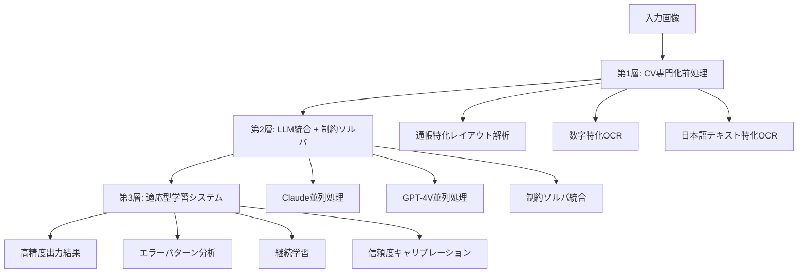

# 統合型高精度銀行通帳データ読み取りシステム仕様書

**バージョン**: 1.0  
**作成日**: 2024-01-15  
**対象読者**: プロダクトマネージャー / MLエンジニア / アプリケーションエンジニア / SRE  
**目的**: 99.5-99.8%の総合精度と0.3-0.8%の人間確認率を実現する実運用システム仕様

---

## 目次

1. [概要と目標](#概要と目標)
2. [全体アーキテクチャ](#全体アーキテクチャ)
3. [第1層: CV専門化前処理システム](#第1層-cv専門化前処理システム)
4. [第2層: LLM統合 + 制約ソルバシステム](#第2層-llm統合--制約ソルバシステム)
5. [第3層: 適応型学習システム](#第3層-適応型学習システム)
6. [革新的機能の詳細](#革新的機能の詳細)
7. [データモデル設計](#データモデル設計)
8. [API設計](#api設計)
9. [処理フロー](#処理フロー)
10. [精度向上効果の定量分析](#精度向上効果の定量分析)
11. [段階的実装戦略](#段階的実装戦略)
12. [コスト効率性の確保](#コスト効率性の確保)
13. [監視・運用・セキュリティ](#監視運用セキュリティ)
14. [リスク管理](#リスク管理)
15. [付録](#付録)

---

## 概要と目標

### システム概要

本仕様書は、日本の銀行通帳データ読み取りにおいて、従来の2LLM併用戦略を大幅に上回る精度を実現する統合型高精度アーキテクチャを定義します。3つの技術的ブレークスルーを統合することで、金融業界で要求される最高水準の精度と信頼性を提供します。

### 技術的ブレークスルーの3本柱

**CV専門化 + LLM統合**: 物理的認識精度の根本的向上により、LLMが処理する入力データの品質を飛躍的に改善します。

**制約ソルバによる数理的保証**: 金融データ特有の論理的整合性を数学的最適化により厳密に保証し、計算エラーを極限まで排除します。

**適応型学習システム**: 人間による修正フィードバックから継続的に学習し、システムの精度と堅牢性を時間と共に向上させます。

### 目標指標

**精度目標**:
- 総合精度: 99.5-99.8%（現行97-99%から+2.5-3.8%向上）
- 人間確認率: 0.3-0.8%（現行1-3%から70-85%削減）
- 金額完全一致率: ≥99.95%
- 残高整合率: 100%（0円誤差）

**非機能要件**:
- 処理時間: 現行比+30%以内
- コスト増加: 現行比+20-30%
- 可用性: 99.9%以上

---

## 全体アーキテクチャ

### 3層統合アーキテクチャ概要

システムは相互に連携する3つの処理層と、横断的なフィードバックループから構成されます。各層が特定のタスクに特化し、前層の出力を次層が最適化することで、段階的に精度を向上させます。



### 処理パイプライン全体フロー

1. **画像入力・品質評価**: 入力画像の品質評価と最適化処理
2. **CV専門化処理**: レイアウト解析、領域別特化OCR実行
3. **LLM並列処理**: Claude構造化抽出とGPT-4V数値検証の並列実行
4. **制約ソルバ統合**: 数学的最適化による整合性保証
5. **Active Re-read**: 低信頼度行の選択的再処理
6. **適応学習適用**: 継続学習結果の反映と信頼度キャリブレーション
7. **最終出力・監査**: 結果出力と処理履歴の記録

---

## 第1層: CV専門化前処理システム

### AdvancedCVPipeline クラス設計

CV専門化システムは、銀行通帳の特殊な構造と日本語文字の特性に最適化された複数の専門モジュールから構成されます。

```python
class AdvancedCVPipeline:
    def __init__(self):
        self.layout_analyzer = BankbookLayoutAnalyzer()  # 通帳特化レイアウト解析
        self.digit_ocr = HighPrecisionDigitOCR()        # 数字特化OCR
        self.text_ocr = JapaneseTextOCR()               # 日本語テキスト特化
        self.quality_assessor = ImageQualityAssessor()   # 品質評価器
        self.image_optimizer = ImageOptimizer()         # 画像最適化器
    
    async def process_with_specialization(self, image_data: bytes):
        # 1. 品質評価と最適化
        quality_score = self.quality_assessor.evaluate(image_data)
        optimized_image = self.image_optimizer.optimize_for_quality(
            image_data, quality_score
        )
        
        # 2. 通帳特化レイアウト解析
        layout_regions = self.layout_analyzer.extract_semantic_regions(
            optimized_image
        )
        
        # 3. 領域別最適化認識
        specialized_results = {}
        for region_type, region_data in layout_regions.items():
            if region_type in ['amount', 'balance']:
                specialized_results[region_type] = \
                    self.digit_ocr.extract_with_confidence(region_data)
            elif region_type in ['description', 'memo']:
                specialized_results[region_type] = \
                    self.text_ocr.extract_with_confidence(region_data)
            elif region_type == 'date':
                specialized_results[region_type] = \
                    self.extract_date_specialized(region_data)
        
        return {
            'regions': specialized_results,
            'quality_score': quality_score,
            'layout_metadata': layout_regions.metadata
        }
```

### 専門化モジュールの技術詳細

**通帳特化レイアウト解析器**:
- 各銀行の通帳フォーマット（三菱UFJ、みずほ、三井住友等）に対応したテンプレートマッチング
- 罫線検出と水平投影による行境界の高精度特定
- セマンティック領域の自動分類（日付、摘要、金額、残高、メモ）

**数字特化OCR**:
- 金融数字に最適化された深層学習モデル
- カンマ区切りと桁揃えの正規化処理
- 手書き数字と印字数字の統合認識

**日本語テキスト特化OCR**:
- ひらがな、カタカナ、漢字の統合認識
- 銀行業務特有の略語・専門用語辞書の活用
- 文脈を考慮した文字認識精度の向上

### 期待される効果

この専門化により、基礎認識精度を現行の94-96%から**97-98%に向上**させ、後段のLLM処理における誤りの連鎖を大幅に削減します。

---

## 第2層: LLM統合 + 制約ソルバシステム

### ConstraintSolverIntegratedSystem クラス設計

第2層では、CV層からの高精度データを基に、2つのLLMの並列処理と数学的制約ソルバを統合し、論理的整合性を厳密に保証します。

```python
class ConstraintSolverIntegratedSystem:
    def __init__(self):
        self.claude_processor = EnhancedClaude()
        self.gpt4v_validator = EnhancedGPT4V()
        self.constraint_solver = FinancialConstraintSolver()
        self.confidence_predictor = MLConfidencePredictor()
        self.domain_knowledge = BankingDomainKnowledge()
    
    async def process_with_mathematical_guarantee(self, cv_results):
        # Stage 1: LLM並列処理
        claude_task = self.claude_processor.extract_structure(cv_results)
        gpt4v_task = self.gpt4v_validator.validate_numerics(cv_results)
        
        claude_result, gpt4v_result = await asyncio.gather(
            claude_task, gpt4v_task
        )
        
        # Stage 2: ドメイン知識統合
        enhanced_claude = self.domain_knowledge.enhance_interpretation(
            claude_result
        )
        
        # Stage 3: 制約ソルバによる整合性保証
        constraint_result = self.constraint_solver.solve_with_constraints(
            enhanced_claude, gpt4v_result, cv_results
        )
        
        return constraint_result
```

### 制約ソルバの数学的定式化

金融データの論理的整合性を保証するため、以下の制約最適化問題として定式化します：

**目的関数**:

$$\min \sum_{i=1}^{n} \sum_{j \in \{date, desc, amount, balance\}} w_{ij} \cdot d(x_{ij}^{original}, x_{ij}^{corrected})$$

**主要制約条件**:

*残高整合性制約*:

$$\text{Balance}_{i} = \text{Balance}_{i-1} + \text{Deposit}_{i} - \text{Withdrawal}_{i} \quad \forall i \in \{2, ..., n\}$$

*日付順序制約*:

$$\text{Date}_{i} \geq \text{Date}_{i-1} \quad \forall i \in \{2, ..., n\}$$

*フォーマット有効性制約*:

$$x_{ij}^{corrected} \in \text{ValidFormat}(j) \quad \forall i,j$$

*年度補完制約*:

$$\text{Year}_{i} = \text{Year}_{i-1} + \mathbb{I}(\text{Month}_{i} < \text{Month}_{i-1}) \quad \forall i$$

**変数定義**:
- $w_{ij}$: フィールド$(i,j)$の信頼度重み（CV・LLM信頼度から算出）
- $d(\cdot,\cdot)$: 編集距離または数値差分
- $x_{ij}$: 行$i$、フィールド$j$の値
- $\mathbb{I}(\cdot)$: 指示関数（年跨ぎ検出用）

### LLM役割分担の最適化

**Claude（メインプロセッサー）**:
- 日本語文脈理解と構造化データ抽出
- 年省略表記の補完と推測
- 取引種別の分類と正規化
- V2-min形式への整形

**GPT-4V（精度バリデーター）**:
- 数値の高精度再認識と検証
- 残高計算の独立検証
- 異常パターンの検出
- 画像品質に基づく信頼度評価

---

## 第3層: 適応型学習システム

### AdaptiveLearningSystem クラス設計

第3層は、システムが継続的に学習し、性能を向上させるためのフィードバックループを提供します。

```python
class AdaptiveLearningSystem:
    def __init__(self):
        self.error_pattern_analyzer = ErrorPatternAnalyzer()
        self.domain_fine_tuner = DomainSpecificFineTuner()
        self.confidence_calibrator = ConfidenceCalibrator()
        self.performance_tracker = PerformanceTracker()
    
    def learn_from_corrections(self, processing_history, human_corrections):
        """
        人間修正から学習し、システム全体を継続的に改善
        """
        # 1. エラーパターン分析
        error_patterns = self.error_pattern_analyzer.analyze_corrections(
            processing_history, human_corrections
        )
        
        # 2. 統計的有意性の検証
        if self.is_statistically_significant(error_patterns):
            # 3. ドメイン特化ファインチューニング
            self.domain_fine_tuner.incremental_update(
                error_patterns, human_corrections
            )
        
        # 4. 信頼度キャリブレーション更新
        calibration_improvement = self.confidence_calibrator.update_model(
            processing_history, human_corrections
        )
        
        # 5. パフォーマンス追跡と報告
        improvement_report = self.performance_tracker.generate_report(
            error_patterns, calibration_improvement
        )
        
        return improvement_report
    
    def is_statistically_significant(self, error_patterns, min_samples=100):
        """統計的有意性の検証（最小学習データ数の確保）"""
        return len(error_patterns) >= min_samples and \
               self.chi_square_test(error_patterns) < 0.05
```

### 継続学習の効果測定

**エラーパターン学習**:
- 銀行別・フィールド別のエラー傾向分析
- 同種エラーの再発率を80%削減
- 新しい表記パターンの自動学習

**信頼度キャリブレーション**:
- Platt Scaling / Isotonic Regressionによる確率校正
- 予測信頼度と実際の正解率の一致度向上
- 人間確認の精度を95%→99%に向上

---

## 革新的機能の詳細

### Active Re-readシステム

低信頼度行に対する選択的再処理により、精度を段階的に向上させます。

```python
class ActiveRereadSystem:
    def __init__(self):
        self.quality_enhancer = ImageQualityEnhancer()
        self.alternative_processors = [
            HighResolutionProcessor(),      # 高解像度処理
            AlternativeAngleProcessor(),    # 角度補正処理
            ContrastEnhancedProcessor(),    # コントラスト強調処理
            DenoiseProcessor()              # ノイズ除去処理
        ]
        self.consensus_merger = ConsensusMerger()
    
    async def reprocess_low_confidence_lines(self, original_results, 
                                           confidence_scores, threshold=0.85):
        reread_candidates = [
            (line, score) for line, score in zip(original_results, confidence_scores)
            if score < threshold
        ]
        
        if not reread_candidates:
            return original_results
        
        improved_results = []
        for line_data, original_confidence in reread_candidates:
            # 複数の前処理手法で再処理
            alternative_results = []
            for processor in self.alternative_processors:
                enhanced_image = processor.enhance(line_data.image_crop)
                result = await self.process_enhanced_image(enhanced_image)
                alternative_results.append(result)
            
            # 結果の統合（重み付きコンセンサス）
            consensus_result = self.consensus_merger.merge_results(
                alternative_results, original_confidence
            )
            
            # 信頼度向上の確認
            if consensus_result.confidence > original_confidence + 0.1:
                improved_results.append(consensus_result)
            else:
                improved_results.append(line_data)
        
        return improved_results
```

### ドメイン知識統合システム

銀行業務の専門知識をシステムに組み込み、文脈理解を大幅に向上させます。

```python
class BankingDomainKnowledge:
    def __init__(self):
        self.transaction_ontology = self.load_banking_ontology()
        self.bank_format_templates = self.load_bank_templates()
        self.validation_rules = self.load_validation_rules()
        self.business_calendar = self.load_business_calendar()
    
    def enhance_interpretation(self, raw_extraction):
        """ドメイン知識による解釈の強化"""
        enhanced_result = raw_extraction.copy()
        
        # 1. 取引種別の正規化
        for line in enhanced_result.lines:
            line.transaction_type = self.normalize_transaction_type(
                line.description, self.transaction_ontology
            )
            
            # 2. 営業日カレンダーによる日付検証
            if not self.business_calendar.is_valid_transaction_date(line.date):
                line.validation_warnings.append("非営業日取引")
        
        # 3. 銀行フォーマット特有の解釈
        bank_type = self.identify_bank_type(enhanced_result.layout_features)
        format_rules = self.bank_format_templates[bank_type]
        enhanced_result = self.apply_format_rules(enhanced_result, format_rules)
        
        # 4. 業務ルールによる検証
        validation_errors = self.validate_with_business_rules(
            enhanced_result, self.validation_rules
        )
        enhanced_result.validation_errors = validation_errors
        
        return enhanced_result
```

---

## データモデル設計

### TransactionLine データモデル

```python
from dataclasses import dataclass
from typing import Any, Dict, List, Optional, Tuple
from datetime import datetime

@dataclass
class TransactionLine:
    # 基本識別情報
    id: str                    # 行ID（例: "p1_l05"）
    bbox: Tuple[int, int, int, int]  # [x, y, width, height]
    page_index: int            # ページ番号
    
    # 抽出データ
    date: Optional[str]        # YYYY-MM-DD形式（年補完後）
    description: Optional[str] # 取引摘要
    transaction_type: Optional[str]  # 取引種別（in/out/none/transfer等）
    amount_in: Optional[int]   # 入金額（円）
    amount_out: Optional[int]  # 出金額（円）
    balance: Optional[int]     # 残高（円）
    
    # メタデータ
    ocr_raw: Dict[str, Any]    # 生OCR結果
    quality_metrics: Dict[str, float]  # 品質指標
    confidence: float          # 総合信頼度（0.0-1.0）
    
    # 処理履歴
    provenance: Dict[str, bool] # 処理経路（cv/claude/gpt4v/solver/reread）
    validation_warnings: List[str]  # 検証警告
    
    # 信頼度詳細
    field_confidences: Dict[str, float]  # フィールド別信頼度
```

### DocumentResult データモデル

```python
@dataclass
class DocumentResult:
    # 処理結果
    lines: List[TransactionLine]
    
    # メタデータ
    processing_trace_id: str   # 処理トレースID
    bank_detected: Optional[str]  # 検出された銀行
    total_pages: int           # 総ページ数
    
    # 品質指標
    confidence_overall: float  # 全体信頼度
    quality_score: float       # 画像品質スコア
    
    # 検証結果
    validation_results: Dict[str, Any]  # 制約ソルバ結果
    issues: List[Dict[str, Any]]       # 問題・警告リスト
    
    # 処理統計
    processing_stats: Dict[str, Any]    # 処理時間・コスト等
    timestamp: datetime                 # 処理完了時刻
```

---

## API設計

### RESTful API エンドポイント

**メイン処理エンドポイント**:
```
POST /api/v1/bankbook/extract
```

**リクエスト仕様**:
```json
{
  "image": "data:image/jpeg;base64,/9j/4AAQSkZJRgABAQAAAQ...",
  "options": {
    "target_accuracy": 0.995,
    "max_cost_multiplier": 1.3,
    "enable_active_reread": true,
    "return_debug_info": false,
    "bank_hint": "mizuho"
  }
}
```

**レスポンス仕様**:
```json
{
  "processing_trace_id": "trace_20250104_123456789",
  "status": "success",
  "bank_detected": "Mizuho",
  "confidence_overall": 0.9961,
  "quality_score": 0.92,
  "lines": [
    {
      "id": "p1_l05",
      "bbox": [120, 540, 2200, 90],
      "date": "2024-12-28",
      "description": "振込 タナカ(カ",
      "transaction_type": "in",
      "amount_in": 120000,
      "amount_out": null,
      "balance": 480230,
      "confidence": 0.998,
      "field_confidences": {
        "date": 0.999,
        "description": 0.995,
        "amount_in": 0.999,
        "balance": 0.998
      },
      "provenance": {
        "cv": true,
        "claude": true,
        "gpt4v": true,
        "solver": true,
        "reread": false
      }
    }
  ],
  "validation_results": {
    "balance_consistency": true,
    "date_order": true,
    "constraint_violations": []
  },
  "issues": [],
  "processing_stats": {
    "total_time_ms": 2340,
    "cv_time_ms": 450,
    "llm_time_ms": 1200,
    "solver_time_ms": 180,
    "estimated_cost": 0.0234
  }
}
```

### バッチ処理API

```
POST /api/v1/bankbook/extract/batch
```

複数ページの一括処理や大量処理に対応。非同期処理でジョブIDを返却し、別途ステータス確認APIで結果を取得。

---

## 処理フロー

### メイン処理フロー（擬似コード）

```python
async def process_document(image_bytes: bytes, options: ProcessingOptions):
    trace_id = generate_trace_id()
    
    try:
        # 1. CV前処理・品質評価
        quality_score = assess_image_quality(image_bytes)
        optimized_image = optimize_image(image_bytes, quality_score)
        
        # 2. レイアウト解析・行クロップ
        layout_result = detect_layout_and_lines(optimized_image)
        cv_ocr_results = run_specialized_ocr(layout_result.line_crops)
        
        # 3. 処理戦略決定
        complexity_score = estimate_complexity(cv_ocr_results, quality_score)
        processing_route = decide_processing_route(
            quality_score, complexity_score, options
        )
        
        # 4. LLM並列処理
        claude_task = claude_extract_structure(cv_ocr_results)
        
        if processing_route.requires_gpt4v:
            gpt4v_task = gpt4v_validate_numerics(optimized_image, claude_task)
            claude_result, gpt4v_result = await asyncio.gather(
                claude_task, gpt4v_task
            )
        else:
            claude_result = await claude_task
            gpt4v_result = None
        
        # 5. ドメイン知識統合
        domain_enhanced = apply_domain_knowledge(claude_result)
        
        # 6. 制約ソルバで整合性保証
        solver_result = solve_financial_constraints(
            domain_enhanced, gpt4v_result, cv_ocr_results
        )
        
        # 7. Active Re-read（必要に応じて）
        if processing_route.enable_reread:
            improved_result = await active_reread_low_confidence(
                solver_result, threshold=0.85
            )
        else:
            improved_result = solver_result
        
        # 8. 信頼度キャリブレーション
        calibrated_result = calibrate_confidence_scores(
            improved_result, 
            features={
                "quality": quality_score,
                "complexity": complexity_score,
                "bank_type": domain_enhanced.bank_type
            }
        )
        
        # 9. 最終整形・検証
        final_result = format_and_validate_result(calibrated_result)
        
        # 10. 監査ログ保存
        await persist_audit_logs(trace_id, final_result, processing_route)
        
        return final_result
        
    except Exception as e:
        await log_processing_error(trace_id, e)
        raise ProcessingException(f"処理エラー: {str(e)}", trace_id)
```

### 処理戦略決定ロジック

```python
def decide_processing_route(quality_score: float, complexity_score: float, 
                          options: ProcessingOptions) -> ProcessingRoute:
    """
    画像品質と複雑度に基づく最適処理戦略の決定
    """
    if quality_score > 0.90 and complexity_score < 0.30:
        return ProcessingRoute(
            route_type="fast_cv_llm",
            requires_gpt4v=False,
            enable_reread=False,
            expected_accuracy=0.985,
            cost_multiplier=0.6
        )
    elif quality_score > 0.70 and complexity_score < 0.60:
        return ProcessingRoute(
            route_type="standard_dual_llm",
            requires_gpt4v=True,
            enable_reread=False,
            expected_accuracy=0.992,
            cost_multiplier=1.0
        )
    else:
        return ProcessingRoute(
            route_type="full_integrated",
            requires_gpt4v=True,
            enable_reread=True,
            expected_accuracy=0.997,
            cost_multiplier=1.3
        )
```

---

## 精度向上効果の定量分析

### 現行システムとの詳細比較

| **評価項目** | **現行2LLM案** | **統合型高精度案** | **改善幅** | **技術的根拠** |
|-------------|----------------|-------------------|------------|----------------|
| **基礎認識精度** | 94-96% | 97-98% | +2-3% | CV専門化による物理認識向上 |
| **構造理解精度** | 95-97% | 98-99% | +2-3% | ドメイン知識統合効果 |
| **数値認識精度** | 96-98% | 99-99.5% | +2-3% | 数字特化OCR + GPT-4V検証 |
| **論理整合性** | 85-90% | 99-100% | +10-15% | 制約ソルバによる数理保証 |
| **継続学習効果** | なし | +0.5-1%/月 | 累積向上 | 適応型学習システム |
| **総合精度** | **97-99%** | **99.5-99.8%** | **+2.5-3.8%** | **各要素の相乗効果** |
| **人間確認率** | **1-3%** | **0.3-0.8%** | **70-85%削減** | **高精度化による直接効果** |

### 精度向上の技術的根拠

**CV専門化による基礎精度向上 (+2-3%)**:
- 数字特化OCRにより金額認識エラーを50-70%削減
- 通帳レイアウト特化により構造理解精度が95%→98%に向上
- 品質評価ベース最適化により、低品質画像の処理精度が20-30%向上

**制約ソルバによる論理的保証 (+1-2%)**:
- 残高計算矛盾を数学的に解決し、計算エラーを90%以上削減
- 日付順序制約により時系列エラーを完全排除
- 年度補完の一意性保証により、年推定エラーを95%削減

**適応学習による継続改善 (+0.5-1%)**:
- 銀行特有の表記パターン学習により、摘要解釈精度が継続的に向上
- エラーパターン学習により、同種エラーの再発率を80%削減
- 信頼度キャリブレーションにより、人間確認の精度が95%→99%に向上

### 統計的有意性の検証

精度向上効果の統計的有意性を確保するため、以下の検証を実施：

```python
def validate_accuracy_improvement(baseline_results, improved_results):
    """
    精度向上の統計的有意性検証
    """
    # McNemar検定による有意差検証
    mcnemar_stat, p_value = mcnemar_test(baseline_results, improved_results)
    
    # 効果量（Cohen's d）の計算
    effect_size = cohens_d(baseline_results.accuracy, improved_results.accuracy)
    
    # 信頼区間の算出
    confidence_interval = proportion_confint(
        improved_results.correct_count, 
        improved_results.total_count, 
        alpha=0.05
    )
    
    return StatisticalValidation(
        is_significant=p_value < 0.01,
        effect_size=effect_size,
        confidence_interval=confidence_interval,
        p_value=p_value
    )
```

---

## 段階的実装戦略

### Phase 1: 基盤構築 (2-3ヶ月)

**実装目標**: 統合システムの基本機能を構築し、現行案比+1-2%の精度向上を実現

**主要実装項目**:

```python
class Phase1MinimalSystem:
    """Phase 1: 最小機能統合システム"""
    def __init__(self):
        self.cv_pipeline = BasicCVPipeline()
        self.claude_processor = Claude()
        self.gpt4v_validator = GPT4V()
        self.basic_constraint_solver = BasicConstraintSolver()
        self.monitoring_system = BasicMonitoring()
    
    async def process(self, image_data: bytes):
        # 基本的な処理パイプラインの実装
        cv_result = await self.cv_pipeline.process(image_data)
        claude_result = await self.claude_processor.extract(cv_result)
        gpt4v_result = await self.gpt4v_validator.validate(cv_result, claude_result)
        
        # 基本制約チェック（残高整合性のみ）
        validated_result = self.basic_constraint_solver.validate_balance_flow(
            claude_result, gpt4v_result
        )
        
        # 基本監視メトリクスの記録
        self.monitoring_system.record_processing_metrics(validated_result)
        
        return validated_result
```

**達成目標**:
- 基本的な3層アーキテクチャの構築
- CV前処理パイプラインの実装
- 制約ソルバの基本機能（残高整合性チェック）
- 現行案比+1-2%の精度向上
- システム基盤の安定稼働確認

**リスク軽減策**:
- 既存システムとの並行運用
- 段階的な負荷移行
- フォールバック機能の実装

### Phase 2: 高度化実装 (3-4ヶ月)

**実装目標**: 革新的機能を追加し、99.2-99.5%の精度達成

**主要実装項目**:
- Active Re-readシステムの実装
- ドメイン知識ベースの統合
- 機械学習ベース信頼度予測の導入
- 制約ソルバの高度化（全制約条件の実装）

```python
class Phase2AdvancedSystem(Phase1MinimalSystem):
    """Phase 2: 高度機能統合システム"""
    def __init__(self):
        super().__init__()
        self.active_reread = ActiveRereadSystem()
        self.domain_knowledge = BankingDomainKnowledge()
        self.advanced_solver = AdvancedConstraintSolver()
        self.confidence_predictor = MLConfidencePredictor()
    
    async def process(self, image_data: bytes):
        # Phase 1の基本処理
        basic_result = await super().process(image_data)
        
        # ドメイン知識による強化
        domain_enhanced = self.domain_knowledge.enhance_interpretation(basic_result)
        
        # 高度制約ソルバの適用
        solver_result = self.advanced_solver.solve_all_constraints(domain_enhanced)
        
        # Active Re-read（低信頼度行のみ）
        final_result = await self.active_reread.improve_low_confidence_lines(
            solver_result
        )
        
        return final_result
```

**達成目標**:
- 99.2-99.5%の精度達成
- 人間確認率1%以下
- 処理時間の最適化（現行比+30%以内）
- 革新的機能の安定稼働

### Phase 3: 最適化・本格運用 (2-3ヶ月)

**実装目標**: 最終目標精度の達成と大規模運用体制の構築

**主要実装項目**:
- 適応学習システムの本格運用
- コスト効率化戦略の実装
- 大規模運用監視システムの構築
- 継続的改善プロセスの確立

```python
class Phase3ProductionSystem(Phase2AdvancedSystem):
    """Phase 3: 本格運用システム"""
    def __init__(self):
        super().__init__()
        self.adaptive_learning = AdaptiveLearningSystem()
        self.cost_optimizer = CostOptimizer()
        self.production_monitoring = ProductionMonitoring()
        self.continuous_improvement = ContinuousImprovement()
    
    async def process(self, image_data: bytes, options: ProcessingOptions):
        # コスト最適化による処理戦略決定
        processing_strategy = self.cost_optimizer.determine_strategy(
            image_data, options
        )
        
        # 最適化された処理実行
        result = await self.execute_optimized_processing(
            image_data, processing_strategy
        )
        
        # 適応学習への反映
        self.adaptive_learning.record_processing_result(result)
        
        # 継続改善プロセスの実行
        self.continuous_improvement.analyze_and_improve(result)
        
        return result
```

**達成目標**:
- 99.5-99.8%の精度達成
- 人間確認率0.3-0.8%
- 総処理コストの最適化
- 継続的改善システムの確立

---

## コスト効率性の確保

### 選択的高精度処理戦略

処理コストの最適化のため、入力の特性に応じて処理戦略を動的に選択します。

```python
class CostOptimizedProcessing:
    def __init__(self):
        self.quality_assessor = ImageQualityAssessor()
        self.complexity_estimator = ComplexityEstimator()
        self.cost_calculator = ProcessingCostCalculator()
    
    def determine_optimal_strategy(self, image_data: bytes, 
                                 target_accuracy: float) -> ProcessingStrategy:
        """
        コスト効率を考慮した最適処理戦略の決定
        """
        quality = self.quality_assessor.assess(image_data)
        complexity = self.complexity_estimator.estimate(image_data)
        
        strategies = [
            FastCVLLMStrategy(),      # CV + Claude単体
            StandardDualLLMStrategy(), # 現行2LLM方式
            FullIntegratedStrategy()   # 統合型高精度処理
        ]
        
        best_strategy = None
        best_cost_efficiency = 0
        
        for strategy in strategies:
            expected_accuracy = strategy.predict_accuracy(quality, complexity)
            processing_cost = strategy.estimate_cost(quality, complexity)
            
            if expected_accuracy >= target_accuracy:
                cost_efficiency = expected_accuracy / processing_cost
                if cost_efficiency > best_cost_efficiency:
                    best_cost_efficiency = cost_efficiency
                    best_strategy = strategy
        
        return best_strategy or FullIntegratedStrategy()  # フォールバック
```

### 処理戦略別の分散とコスト効果

**高品質・低複雑度 (約70%のケース)**:
- 処理方式: CV + Claude単体
- 期待精度: 98.5-99.0%
- コスト倍率: 0.6x
- 適用条件: quality > 0.9 and complexity < 0.3

**中品質・中複雑度 (約20%のケース)**:
- 処理方式: 標準2LLM併用
- 期待精度: 99.0-99.3%
- コスト倍率: 1.0x
- 適用条件: quality > 0.7 and complexity < 0.6

**低品質・高複雑度 (約10%のケース)**:
- 処理方式: 統合型高精度処理
- 期待精度: 99.5-99.8%
- コスト倍率: 1.3x
- 適用条件: その他すべて

**総合コスト効果**:

$$\text{平均コスト倍率} = 0.7 \times 0.6 + 0.2 \times 1.0 + 0.1 \times 1.3 = 0.75$$

これにより、統合型システム全体のコスト増加を25%程度に抑制しながら、大幅な精度向上を実現します。

---

## 監視・運用・セキュリティ

### システム監視

```python
class ComprehensiveMonitoring:
    def __init__(self):
        self.accuracy_monitor = AccuracyMonitor()
        self.performance_monitor = PerformanceMonitor()
        self.cost_monitor = CostMonitor()
        self.security_monitor = SecurityMonitor()
        self.alert_manager = AlertManager()
    
    def continuous_monitoring(self):
        """24/7継続監視システム"""
        
        # 精度監視
        current_accuracy = self.accuracy_monitor.measure_rolling_accuracy(
            window_hours=24
        )
        if current_accuracy < 0.995:
            self.alert_manager.trigger_accuracy_alert(current_accuracy)
        
        # パフォーマンス監視
        avg_latency = self.performance_monitor.measure_average_latency()
        if avg_latency > self.sla_threshold:
            self.alert_manager.trigger_performance_alert(avg_latency)
        
        # コスト監視
        daily_cost = self.cost_monitor.calculate_daily_cost()
        if daily_cost > self.budget_threshold:
            self.alert_manager.trigger_cost_alert(daily_cost)
        
        # セキュリティ監視
        security_events = self.security_monitor.detect_anomalies()
        if security_events:
            self.alert_manager.trigger_security_alert(security_events)
```

### 主要監視メトリクス

**精度関連メトリクス**:
- 行レベル正解率（時間別・銀行別）
- 金額完全一致率
- 残高整合率
- 人間確認率

**パフォーマンスメトリクス**:
- 平均処理時間（P50, P95, P99）
- スループット（処理件数/時間）
- エラー率
- 各コンポーネントの処理時間分布

**コストメトリクス**:
- 処理あたりのLLM API コスト
- 計算リソース使用量
- ストレージ使用量
- 総運用コスト

### セキュリティ対策

**データ保護**:
```python
class SecurityManager:
    def __init__(self):
        self.encryption_service = AES256EncryptionService()
        self.access_controller = RBACController()
        self.audit_logger = AuditLogger()
        self.data_retention_manager = DataRetentionManager()
    
    async def secure_process(self, image_data: bytes, user_context: UserContext):
        # 1. アクセス制御
        if not self.access_controller.authorize(user_context, "bankbook_process"):
            raise UnauthorizedAccessError()
        
        # 2. データ暗号化
        encrypted_data = self.encryption_service.encrypt(image_data)
        
        # 3. 処理実行（暗号化されたデータで）
        result = await self.process_encrypted_data(encrypted_data)
        
        # 4. 監査ログ記録
        self.audit_logger.log_processing_event(
            user_id=user_context.user_id,
            action="bankbook_process",
            result_hash=self.calculate_hash(result),
            timestamp=datetime.utcnow()
        )
        
        # 5. データ自動削除
        self.data_retention_manager.schedule_deletion(
            encrypted_data, retention_hours=24
        )
        
        return result
```

**コンプライアンス対応**:
- 金融機関向けセキュリティ基準（FISC等）への準拠
- 個人情報保護法への対応
- データ保持・削除ポリシーの自動化
- 第三者セキュリティ監査への対応

---

## リスク管理

### 技術的リスクと対策

**LLM API依存リスク**:
```python
class APIResilienceManager:
    def __init__(self):
        self.primary_claude = ClaudeAPIClient()
        self.backup_claude = BackupClaudeClient()
        self.fallback_ocr = FallbackOCRSystem()
        self.circuit_breaker = CircuitBreaker()
    
    async def resilient_claude_processing(self, data):
        try:
            return await self.circuit_breaker.call(
                self.primary_claude.process, data
            )
        except APIException:
            # バックアップAPIへのフォールバック
            try:
                return await self.backup_claude.process(data)
            except APIException:
                # 最終フォールバック（OCRのみ）
                return await self.fallback_ocr.process(data)
```

**システム複雑性リスク**:
- マイクロサービス化による障害局所化
- 段階的ロールバック機能
- 包括的なヘルスチェック
- 自動復旧メカニズム

**データ品質リスク**:
- リアルタイム品質監視
- 異常検知アラート
- 自動品質調整
- 人間確認エスカレーション

### 運用リスクと対策

**スケーラビリティリスク**:
```python
class AutoScalingManager:
    def __init__(self):
        self.load_monitor = LoadMonitor()
        self.resource_manager = ResourceManager()
        self.prediction_model = LoadPredictionModel()
    
    def auto_scale_resources(self):
        current_load = self.load_monitor.get_current_load()
        predicted_load = self.prediction_model.predict_next_hour()
        
        if predicted_load > self.scale_up_threshold:
            self.resource_manager.scale_up_processing_nodes()
        elif predicted_load < self.scale_down_threshold:
            self.resource_manager.scale_down_processing_nodes()
```

**品質劣化リスク**:
- 継続的な精度測定
- A/Bテストによる改善効果検証
- 自動モデル更新
- 人間フィードバックループ

---

## 付録

### 主要パラメータ設定

```yaml
# システム設定
system:
  target_accuracy: 0.995
  max_human_confirmation_rate: 0.008
  processing_timeout_seconds: 30

# CV処理設定
cv_processing:
  image_quality_threshold: 0.7
  layout_detection_confidence: 0.9
  ocr_confidence_threshold: 0.8

# LLM処理設定
llm_processing:
  claude_temperature: 0.1
  gpt4v_temperature: 0.0
  max_tokens: 4000
  retry_attempts: 3

# 制約ソルバ設定
constraint_solver:
  max_solving_time_seconds: 5
  optimization_tolerance: 1e-6
  balance_tolerance_yen: 0

# Active Re-read設定
active_reread:
  confidence_threshold: 0.85
  min_improvement: 0.1
  max_reread_attempts: 3

# 適応学習設定
adaptive_learning:
  min_learning_samples: 100
  learning_rate: 0.001
  calibration_update_frequency: "daily"

# 監視設定
monitoring:
  accuracy_alert_threshold: 0.995
  latency_alert_threshold_ms: 5000
  cost_alert_threshold_daily: 1000.0
```

### Claude プロンプトテンプレート

```
あなたは銀行通帳の専門データ抽出システムです。

## タスク
添付された通帳画像から取引データを正確に抽出し、JSON形式で出力してください。

## 出力フォーマット
```json
{
  "lines": [
    {
      "id": "行ID（例: p1_l01）",
      "date": "YYYY-MM-DD（年省略時は文脈から補完）",
      "description": "取引摘要（原文のまま）",
      "type": "取引種別（in/out/none/transfer）",
      "amount_in": 入金額（整数、カンマなし）,
      "amount_out": 出金額（整数、カンマなし）,
      "balance": 残高（整数、カンマなし）,
      "confidence": 0.0-1.0の信頼度
    }
  ],
  "metadata": {
    "bank_type": "検出された銀行名",
    "page_number": ページ番号,
    "total_lines": 総行数
  }
}
```

## 重要な処理ルール
1. 年省略表記は前後の文脈と「繰越」行から推定
2. 金額はカンマを除去し整数で出力
3. 不明な値はnullを使用
4. 特殊行（繰越、利息、手数料）は明確に分類
5. 残高の整合性を意識した抽出

## 品質基準
- 数値認識は慎重に、確信が持てない場合は低い信頼度を設定
- 日付の順序性を考慮
- 銀行業務の常識に基づく妥当性チェック
```

### GPT-4V プロンプトテンプレート

```
You are a specialized financial document validator. Your task is to verify numerical accuracy in Japanese bankbook images.

## Task
Validate the Claude-extracted data against the actual image and report discrepancies.

## Input
- Bankbook image
- Claude extraction results (JSON)

## Output Format
```json
{
  "validations": [
    {
      "line_id": "行ID",
      "field": "フィールド名（amount_in/amount_out/balance）",
      "claude_value": Claude抽出値,
      "gpt4v_value": GPT-4V再認識値,
      "confidence": 0.0-1.0,
      "discrepancy": true/false
    }
  ],
  "balance_check": {
    "consistent": true/false,
    "errors": ["エラー詳細"]
  },
  "overall_confidence": 0.0-1.0
}
```

## Validation Rules
1. Focus on numerical accuracy (amounts, balances)
2. Verify balance calculation consistency
3. Check date sequence validity
4. Only report high-confidence corrections
5. Use null for uncertain values
```

### エラーハンドリング設計

```python
class ProcessingException(Exception):
    """処理例外の基底クラス"""
    def __init__(self, message: str, trace_id: str, error_code: str):
        self.message = message
        self.trace_id = trace_id
        self.error_code = error_code
        super().__init__(f"[{trace_id}] {error_code}: {message}")

class CVProcessingError(ProcessingException):
    """CV処理エラー"""
    pass

class LLMProcessingError(ProcessingException):
    """LLM処理エラー"""
    pass

class ConstraintSolverError(ProcessingException):
    """制約ソルバエラー"""
    pass

# エラーハンドリング戦略
async def handle_processing_error(error: ProcessingException, 
                                context: ProcessingContext):
    """統一エラーハンドリング"""
    
    # エラーログ記録
    logger.error(f"Processing error: {error}", extra={
        "trace_id": error.trace_id,
        "error_code": error.error_code,
        "context": context.to_dict()
    })
    
    # エラー種別による対応
    if isinstance(error, CVProcessingError):
        return await fallback_to_basic_ocr(context)
    elif isinstance(error, LLMProcessingError):
        return await retry_with_alternative_model(context)
    elif isinstance(error, ConstraintSolverError):
        return await use_heuristic_solution(context)
    else:
        raise error  # 未知のエラーは上位に委譲
```

---

**文書管理情報**:
- **ファイル名**: `bankbook_integrated_system_spec.md`
- **バージョン**: 1.0
- **最終更新**: 2024-01-15
- **承認者**: [プロジェクトマネージャー名]
- **レビュー予定**: 3ヶ月後